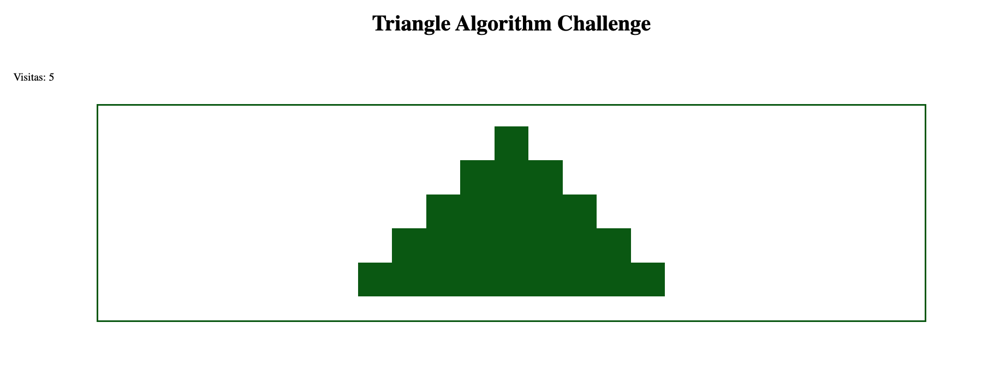

# Desafio Bloco 5

Existem três arquivos, `script.js`, `style.css` e `index.html` para que vocês utilizem como base.

## Agora é a hora do desafio de entender a pirâmide!

Vocês devem entender todo o algoritmo JavaScript, assim como as partes CSS e HTML que já existem no repositório.

**Sua página:**

1. Utiliza o algoritmo de criação de pirâmide de asteriscos para gerar a pirâmide da imagem a seguir.

2. Tem a classe `box`. Sua dimensão é de `50px` porque esse CSS está assumindo uma pirâmide de base 9, ou seja, com 5 linhas.

3. Utiliza LocalStorage para a criação do contador de visitas;

4. Tem a aparência próxima à imagem abaixo;

## Refatorando

O desafio extra é a implementação de modificações que deixem o código mais bem escrito. Usem a imaginação!

**Divirtam-se!🚀🔼**
